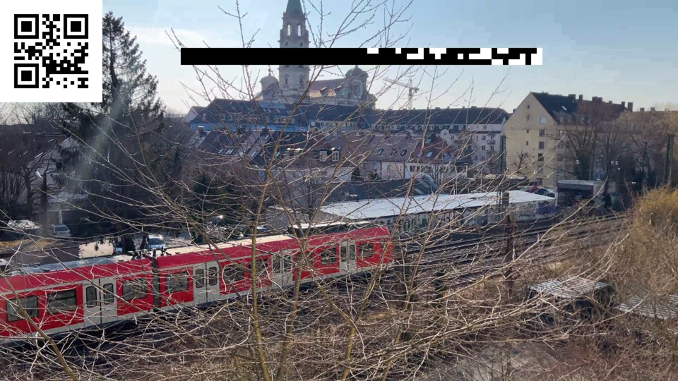

gst-timecode
----



The GStreamer element adds time information to each frame that passes through it. This allows the calculation of the playback latency. The element modifies raw I420 buffers and therefore typically needs to be placed before an encoder / after a decoder.

The lines encode 64-bit integers and contain (frame top to bottom):
* `sec_offset`: the UNIX time at the beginning of the video playback (does not change)
* `ts`: the microseconds since `sec_offset` 
* `frame_nr`: the frame nr, starting at 0

The GStreamer element `timecodeoverlay` adds these timestamps to each frame, while `timecodeparse` reads the information and uses its local time `now` to calculate the playback latency, i.e., the time difference between `now` and `ts`.

Both elements expect a parameter `logfile` that contains the path where information about each frame is written to.

# Sample output
## Sender log output
```
ts      frame_nr        time_s  sec_offset
2022-03-23 11:16:24.540308Z     0       540299  1648034184
2022-03-23 11:16:24.568275Z     1       568272  1648034184
2022-03-23 11:16:24.586687Z     2       586681  1648034184
2022-03-23 11:16:24.604012Z     3       604006  1648034184
2022-03-23 11:16:24.624152Z     4       624146  1648034184
2022-03-23 11:16:24.651485Z     5       651480  1648034184
2022-03-23 11:16:24.685037Z     6       685033  1648034184
2022-03-23 11:16:24.718391Z     7       718387  1648034184
2022-03-23 11:16:24.751808Z     8       751804  1648034184
```

## Player log output

```
ts      frame_nr        latency time_s  time_p  sec_offset
2022-03-23 11:16:25.863182Z     36      178256  1684924 1863180 1648034184
2022-03-23 11:16:25.896003Z     37      177611  1718391 1896002 1648034184
2022-03-23 11:16:25.929350Z     38      177662  1751687 1929349 1648034184
2022-03-23 11:16:25.962183Z     39      177161  1785020 1962181 1648034184
2022-03-23 11:16:25.995769Z     40      177368  1818399 1995767 1648034184
2022-03-23 11:16:26.028441Z     41      176669  1851769 2028438 1648034184
```


# Compiling
```
meson builddir
ninja -C builddir
```

To use the plugin:
```
export GST_PLUGIN_PATH="$(pwd)/builddir/"
gst-inspect-1.0 timecodeoverlay
gst-inspect-1.0 timecodeparse
```
